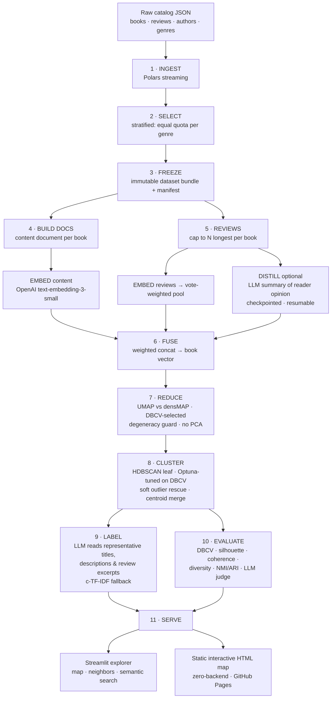

# 📚 Semantic Book Atlas

**A map of the book world, organized by what books are actually about — and how readers actually talk about them.**


> Thousands of books, sampled **evenly across every genre**, are embedded from two complementary signals — the book's own content and the language of its reader reviews — then fused, projected, clustered into human-meaningful reader-interest groups, **named and described by an LLM reading real reviews**, scored against a multi-metric evaluation panel, and served as an interactive, zoomable atlas. End to end on cheap API calls. No GPU. No fine-tuning.

---

## Table of Contents

1. [The Problem: Publishing's Discoverability Crisis](#1-the-problem-publishings-discoverability-crisis)
2. [The Solution: What the Atlas Does](#2-the-solution-what-the-atlas-does)
3. [Who Benefits: Use Cases Across the Book Ecosystem](#3-who-benefits-use-cases-across-the-book-ecosystem)
4. [Architecture](#4-architecture)
5. [Evaluation: How "Good" Is Measured](#5-evaluation-how-good-is-measured)
6. [Roadmap: Increasing Quality, Efficiency & Scale](#6-roadmap-increasing-quality-efficiency--scale)
7. [Honest Limitations](#7-honest-limitations)
8. [Quickstart](#8-quickstart)
9. [Repository Layout](#9-repository-layout)
10. [Data, Citations & Acknowledgements](#10-data-citations--acknowledgements)

---

## 1. The Problem: Publishing's Discoverability Crisis

Publishing does not have a supply problem. It has a **findability** problem.

**📈 The flood.** Roughly [4 million new titles](https://wordsrated.com/number-of-books-published-per-year-2021/) enter the market every year — only 500K–1M of them through traditional publishers; the rest is a self-publishing wave that keeps accelerating. Industry analysts now openly describe the marketplace as [oversaturated](https://selfpublishing.com/publishing-by-the-numbers/), with nearly every title published in recent decades *still available for sale* and competing for the same attention. In a [$151B global book market](https://selfpublishing.com/publishing-by-the-numbers/) projected to reach ~$192B by 2030, the scarce resource is no longer shelf space — it is the reader's ability to find the right book.

**📉 The consequence.** The [average US title now sells fewer than 200 copies a year and fewer than 1,000 in its lifetime](https://www.tonerbuzz.com/blog/how-many-books-are-published-each-year/). Most books are not bad — they are *invisible*. They never meet the readers who would have loved them.

**🏷️ The classification gap.** The industry's answer to organization — subject codes like BISAC/BIC/Thema — is coarse, human-assigned, inconsistent across publishers, and blind to the dimensions readers actually care about: tone, pacing, emotional register, themes, "vibes." Two thrillers can share a code and have nothing in common for an actual reader. Yet classification is commercially decisive: Nielsen's metadata studies found that [whether a book carries an accurate subject classification is among the strongest bibliographic influencers on its average sales](https://www.copyright.com.au/2020/12/link-records-book-sales/), and that titles with [complete basic metadata sell roughly **double** the average of titles without it](https://nielseniq.com/global/en/landing-page/nielseniq-bookdata-metadata/). Better organization is not a nice-to-have. It is revenue.

**🤝 The recommendation gap.** Discovery is now algorithmic: McKinsey's widely cited analysis attributed [~35% of Amazon purchases and ~75% of Netflix viewing to recommendation engines](https://www.newamerica.org/oti/reports/why-am-i-seeing-this/case-study-amazon/), and Netflix has estimated its personalization saves it [around $1B per year in retention](https://www.numberanalytics.com/blog/6-ways-product-recommendations-revolutionize-outcomes). But classic collaborative filtering needs behavioral history — which **new and backlist titles don't have** (the cold-start problem). The titles that most need discovery are the ones recommendation engines serve worst.

**🗣️ The unused signal.** Meanwhile, the richest description of every book already exists, for free, at scale: **reader reviews**. Readers describe books in the language other readers search with — "slow-burn," "unreliable narrator," "cozy," "devastating." The commercial power of that language is proven: social reader communities drove [tens of millions of US print sales](https://selfpublishing.com/publishing-by-the-numbers/) in a single year through nothing more than readers describing books to each other. Publishers' own metadata almost never captures it.

> **The gap this project closes:** organize a book catalog by *machine-read content* **and** *authentic reader language*, so that classification, discovery, and recommendation stop depending on coarse codes and behavioral history that most books will never have.

---

## 2. The Solution: What the Atlas Does

The Semantic Book Atlas turns a raw catalog (metadata + reviews) into an **explorable semantic map** and a set of **production-grade data assets**:

| Capability | What you get |
|---|---|
| 🗺️ **Interactive atlas** | A zoomable 2-D map of the whole catalog; every point is a book, distance ≈ reader-perceived similarity, hover reveals title/author/category |
| 🧩 **Data-driven categories** | Books grouped into reader-interest clusters discovered from the data — not imposed by a legacy taxonomy |
| 🏷️ **LLM-written labels** | Each cluster gets a concise name and one-line description generated from **real review excerpts and representative titles**, with a keyword-based offline fallback |
| 📖 **"More like this"** | Content-based nearest-neighbor recommendations that work on day one for any title — no clicks or purchase history required |
| 🔎 **Semantic search** | Free-text queries ("atmospheric gothic mystery in a small town") matched in embedding space, beyond keyword matching |
| 📊 **Evaluation panel** | Every run is scored on cluster validity, coherence, diversity, alignment with legacy genres, and an LLM-as-judge review |
| 🧾 **Reusable artifacts** | Book vectors, 2-D coordinates, cluster assignments, and labels as clean Parquet/NumPy files — ready to power downstream apps |

**Three design choices make it different:**

1. **Fused representation.** Every book is embedded from complementary signals concatenated into one vector: *(a)* its content document (title, description, metadata), *(b)* a vote-weighted pool of its reader reviews, and *(c)* optionally, an LLM-distilled summary of what readers say. The atlas therefore encodes both *what the book is* and *how it lands with readers*.
2. **Balanced by construction.** Stratified sampling gives every genre an equal quota, so small categories (poetry, comics, history) are first-class citizens of the map instead of being drowned by fiction and romance.
3. **Radically cheap and reproducible.** The entire pipeline — embedding, distillation, clustering, labeling, judging — runs on hosted APIs for **≈ $3–5 per full run** (≈ $0.25 with distillation off), on any laptop, with frozen datasets, pinned seeds, and checkpointed resumable stages.

---

## 3. Who Benefits: Use Cases Across the Book Ecosystem

*Capabilities marked ⚙️ are natural extensions of the shipped artifacts rather than features of the demo app itself.*

### 🏢 Publishers & Acquisition Editors
- **White-space analysis** — see your list *and the market* on one map; sparse regions between dense reader-interest clusters are quantified acquisition opportunities instead of hunches.
- **Comp-title discovery** — nearest-neighbor search surfaces comparable titles by *reader-perceived similarity*, not just shared BISAC codes, strengthening P&Ls and pitch decks.
- **Backlist revival** — find dormant backlist titles that sit semantically next to current bestsellers and re-promote them ("if the market loves X, we already own its neighbors"). ⚙️
- **Metadata enrichment at scale** — cluster labels and keywords become subject headings and retailer keywords; given Nielsen's finding that complete, accurate metadata correlates with ~2× average sales, this is a directly monetizable output.
- **Series & imprint positioning** — visualize where each imprint actually lives in reader-interest space versus where its brand claims to live.

### 📣 Marketing & Audience Teams
- **Segmentation that matches reality** — plan campaigns around discovered reader-interest clusters ("dark academia," "healing memoirs") rather than legacy genre codes.
- **Copy grounded in reader language** — the review-distillation layer yields, for every book, a neutral summary of what readers praise and criticize: raw material for blurbs, ads, and A/B tests written in the audience's own vocabulary.
- **"For readers of…" targeting** — neighbor lists translate directly into lookalike campaign hooks and cross-promotion pairings.
- **Trend telescopes** ⚙️ — re-running the pipeline on time-sliced review data shows clusters growing or shrinking, an early-warning system for emerging niches.

### 🛒 Booksellers, Retailers & Marketplaces
- **Shelving beyond BISAC** — curate digital shelves and physical displays from clusters that reflect how customers actually group books.
- **Cold-start recommendations** — content-based "more like this" works the moment a title is listed, precisely where collaborative filtering fails; recommendation quality is a proven revenue lever (35% of purchases at the canonical example).
- **Semantic site search** ⚙️ — let shoppers search by mood and theme, not just title and author.
- **Assortment planning** — cluster-level sales roll-ups reveal over- and under-stocked interest areas.

### 🏛️ Libraries & Educational Institutions
- **Readers' advisory, supercharged** — "you liked this, try these" grounded in what patrons say about books, a natural fit for library discovery layers.
- **Collection development** — map the collection against the atlas to find underserved interest clusters in the community.
- **Browsable discovery** — a visual map is a fundamentally more inviting interface for patrons (and students) than a search box.

### 📱 Reading Apps & Subscription Platforms
- **Onboarding without history** — new users pick a few books; the atlas immediately yields taste neighborhoods to seed feeds (no cold start).
- **Explainable recommendations** — "recommended because readers describe both as *slow-burn found-family fantasy*" builds trust in a way black-box scores cannot.
- **Editorial automation** — LLM-labeled clusters are ready-made, refreshable collection pages ("Quiet Literary Horror", "Feel-Good Sports Romance").

### ✍️ Authors & Self-Publishers
- **Positioning** — locate your manuscript's true neighbors to choose categories, keywords, and comps with evidence instead of guesswork.
- **Market-gap scouting** — visible sparse zones near dense, high-engagement clusters suggest what to write *next*.
- **Blurb intelligence** — distilled reader language from adjacent books shows which promises resonate with your target readers.

### 🧪 Data, BI & ML Teams
- **A reference architecture** for embedding → reduction → density clustering → LLM labeling → evaluation, with every design decision documented and defended.
- **Cheap to fork** — the ~$3–5 cost and GPU-free design make it a realistic internal prototype for *any* catalog-shaped data (products, courses, films, podcasts).
- **Evaluation-first culture** — the metrics panel (including an LLM-as-judge and degeneracy guards) is reusable scaffolding for other unsupervised projects, where "looks fine" is otherwise the only test.

---

## 4. Architecture

### 4.1 Pipeline at a Glance



### 4.2 Stage-by-Stage Rationale

| # | Stage | What it does | Why it is designed this way |
|---|---|---|---|
| 1 | **Ingest** | Streams multi-GB newline-JSON into typed Parquet with Polars | Lazy/streaming execution keeps memory flat; raw files are never mutated |
| 2 | **Select** | Stratified sample — equal quota per genre, most-reviewed within each, automatic top-up for thin genres | Prevents the map from being 80% fiction; small genres become visible structure |
| 3 | **Freeze** | Writes an immutable dataset bundle + manifest, verified before anything downstream runs | Reproducibility: every artifact traces to one frozen snapshot |
| 4 | **Build docs** | One clean "content document" per book (title, author, description, metadata) | A controlled, uniform input for the content embedding |
| 5 | **Reviews** | Keeps the N longest reviews/book; embeds; **vote-weighted mean pool** per book; optional **LLM distillation** into a neutral 3–4 sentence reader-opinion summary | Longest reviews carry the most signal per token; helpful-vote weighting promotes trusted voices; distillation converts noisy review piles into dense semantic text |
| F | **Fuse** | L2-normalized weighted concatenation of content ⊕ review-pool ⊕ distillation vectors | Books are positioned by *what they are* and *how readers experience them*; missing blocks degrade gracefully to zero-vectors |
| 6 | **Reduce** | Benchmarks UMAP and densMAP at 10-D, scores each with DBCV via a quick clustering, picks the winner; separate 2-D projection for display only. **No PCA** | Non-linear neighbor-graph methods preserve the local structure density clustering needs; PCA's linear compression and t-SNE's global distortion are deliberately rejected; **a minimum-cluster eligibility guard prevents a reducer from "winning" with a degenerate two-blob solution** (see §5) |
| 7 | **Cluster** | HDBSCAN (leaf selection) tuned by Optuna on DBCV with a noise penalty; search space **derived from dataset size**; low-confidence outliers soft-rescued via membership vectors; near-duplicate clusters merged by centroid cosine | Density clustering discovers the number of clusters and admits "noise" honestly; every heuristic (rescue threshold, merge threshold, search bounds) is an exposed config knob |
| 8 | **Label** | For each cluster: c-TF-IDF keywords (hint + offline fallback) → representative books nearest the centroid → the LLM reads their titles, descriptions, and real review excerpts → concise name + description | Grounding labels in authentic documents beats word-frequency lists; the fallback keeps the pipeline functional with zero LLM access |
| 9 | **Evaluate** | Full metrics panel written to `reports/metrics.json` (see §5) | Unsupervised ≠ unaccountable |
| 10 | **Serve** | Streamlit explorer (map, neighbor search, semantic search via a single query-embedding call, category browsing) + a static interactive HTML map for zero-backend sharing | The explorer is deliberately GPU-free (NumPy cosine kNN) so it deploys to any free CPU tier |

### 4.3 Engineering Hardening

Design details that make the pipeline behave like production software rather than a notebook:

- **🔁 Resumable spend** — every LLM distillation result is checkpointed to JSONL the moment it succeeds; a crashed or interrupted run resumes exactly where it stopped instead of re-paying for thousands of calls.
- **📦 Token-budgeted batching** — embedding requests are packed against *both* the item-count and total-token caps of the API, with exponential-backoff retry on rate limits and transient errors.
- **🌡️ Parameter-compatibility fallback** — if a model rejects a sampling parameter (a common failure across LLM model families), the client retries without it rather than failing the stage.
- **🧭 Self-diagnosing configuration** — a missing API key produces a diagnostic that identifies the *cause* (dotenv not installed, `.env` misnamed, wrong encoding, malformed line) instead of a dead-end error.
- **🛡️ Degeneracy guards** — metric-driven selection steps are constrained so they cannot "win" with trivial solutions (see §5).
- **🔬 Deterministic by default** — pinned seeds, frozen data bundles, and pinned dependency floors; the reproducibility/speed trade-off is a documented knob.

### 4.4 Technology Stack

| Layer | Choice | Note |
|---|---|---|
| Data engine | **Polars** (lazy + streaming) | Multi-GB JSON on laptop RAM |
| Embeddings | **OpenAI `text-embedding-3-small`** | Strong clustering quality at $0.02 / 1M tokens |
| LLM (distill · label · judge) | **OpenAI `gpt-5.4-nano`** | Cheapest tier, purpose-fit for high-volume summarize/extract; provider-agnostic client (any OpenAI-compatible endpoint, including local) |
| Reduction | **umap-learn** (UMAP / densMAP) | DBCV-selected, guarded |
| Clustering | **hdbscan** + **Optuna** | Leaf selection, tuned, soft rescue, merge |
| Evaluation | scikit-learn · hdbscan validity · gensim (optional) · LLM judge | Full panel in one JSON |
| Serving | **Streamlit + Plotly**, **DataMapPlot** static HTML | Free-tier deployable, zero-backend option |
| Orchestration | Plain `python -m` stages + optional **DVC** graph with params tracking | Each stage is independently re-runnable |
| Config & secrets | `params.yaml` + `.env` (python-dotenv) | Every heuristic is a documented knob; no secrets in code |

### 4.5 Cost Profile (full run, projected)

| Component | Model | Standard | Batch API (−50%) |
|---|---|---|---|
| Embeddings (reviews + content) | text-embedding-3-small | ~$0.20–1.00 * | ~half |
| Review distillation (optional) | gpt-5.4-nano | ~$2.50–3.10 | ~half |
| Labeling + LLM judge | gpt-5.4-nano | ~$0.05 | ~half |
| **Total** | | **≈ $3–5** | **≈ $1.5–2.5** |

\* Scales with review length; keeping the *longest* reviews per book raises token volume toward the upper bound. With `reviews.distill: false`, the entire pipeline costs **≈ $0.25–1.25**.

---

## 5. Evaluation: How "Good" Is Measured

Unsupervised clustering fails silently: a bad map still *renders*. The Atlas therefore treats evaluation as a first-class pipeline stage, writing a full panel to `reports/metrics.json` on every run:

| Metric | Question it answers |
|---|---|
| **DBCV** (primary) | Are clusters dense and well-separated, accounting for noise? |
| **DBCV<sub>core</sub>** | Same metric on *core* members only — exposing how much the soft outlier-rescue step blurs boundaries. A large gap between core and final DBCV is a tuning signal, not a mystery |
| **Silhouette** | Classical cohesion vs. separation cross-check |
| **Noise fraction** | How much of the catalog the clustering honestly declines to classify |
| **Topic coherence (c_v)** | Do a cluster's keywords co-occur in its documents? |
| **Topic diversity** | Are clusters *distinct from each other*, or variations on one theme? |
| **NMI / ARI vs. legacy genres** | Sanity anchor: clusters should *correlate* with genre without *reproducing* it — the interesting structure is where clusters cut across genre lines |
| **LLM-as-judge** | A model rates each cluster's thematic coherence from member titles/snippets — a scalable proxy for human review |

**Guardrails against metric gaming.** Optimizing any single number invites degenerate winners — for example, collapsing the whole catalog into two giant, well-separated blobs produces a *spectacular* DBCV and a useless atlas. The pipeline therefore constrains its metric-driven choices: reducer selection requires a **minimum benchmark cluster count** to be eligible, the Optuna objective carries an explicit **noise penalty**, and the tuner's search space is **derived from the dataset size** rather than hardcoded. The general principle: *every automated selection step must be inspectable, and no metric is trusted without a constraint that encodes what the metric cannot see.*

---

## 6. Roadmap: Increasing Quality, Efficiency & Scale

The current system is a deliberately lean v1. Each item below names a concrete method, why it works, and what it costs to adopt.

### 6.1 Representation Quality
| Improvement | Method & expected effect |
|---|---|
| **Upgrade the embedder** | Swap to `text-embedding-3-large` (one config line). Embedding quality is the ceiling on everything downstream; at this corpus size the delta costs roughly a dollar — the highest-leverage dollar in the project |
| **Calibrate fusion weights** | In concatenation fusion, block weights act *quadratically* on cosine similarity; applying √w scaling makes configured ratios literal, and a small grid-search over weights scored by DBCV/coherence turns fusion into a tuned component |
| **Language filtering / multilingual mode** | Filter to one language for a cleaner monolingual atlas, or switch to a multilingual embedder to make the map language-aware by design |
| **Domain-adapted embeddings** | Fine-tune a compact open embedder on review-pair similarity (books co-praised by the same readers) for a bespoke "reader-taste space" — the natural step once scale justifies training |
| **Matryoshka / reduced dimensions** | Modern embedding APIs allow requesting shorter vectors at minimal quality loss — smaller artifacts, faster math, cheaper serving |

### 6.2 Clustering & Labeling Quality
| Improvement | Method & expected effect |
|---|---|
| **Hierarchical atlas** | Run coarse→fine clustering (or cut HDBSCAN's condensed tree at multiple levels) for a drill-down taxonomy: *Speculative → Fantasy → Cozy Dragon Fantasy* |
| **KeyBERTInspired keywords** | Replace frequency-based c-TF-IDF hints with embedding-similarity keyword scoring — semantically coherent phrases instead of frequent words |
| **Label stability & QA** | Generate labels k times, embed, and keep the medoid; add a self-critique pass (LLM verifies its label against members) to cut variance and hallucination |
| **Consensus clustering** | Ensemble multiple UMAP seeds / parameterizations and keep agreements — stability as a first-class quality signal |
| **Post-hoc probability refresh** | Recompute membership confidence after merge/rescue so downstream consumers get calibrated per-book confidence |

### 6.3 Cost Efficiency
| Improvement | Method & expected effect |
|---|---|
| **Batch API** | Both embeddings and completions qualify for ~50% discounts as asynchronous batch jobs — halves the bill for any full re-run |
| **Prompt-prefix caching** | Distillation prompts share a long fixed instruction prefix; structuring calls to exploit cached prefixes cuts input-token cost on repeated runs |
| **Tiered distillation** | Distill only high-review-count books (a config knob); pooled review embeddings alone remain a strong signal at ~7% of the cost |
| **Incremental runs** | Content-addressed caching of embeddings/summaries by (book, model, prompt-hash) means only *new or changed* books are ever re-paid for |

### 6.4 Scaling the Corpus (thousands → millions)
| Improvement | Method & expected effect |
|---|---|
| **GPU acceleration** | `cuML`'s UMAP/HDBSCAN are drop-in replacements that turn hours into minutes at 250K+ points — the pipeline's config already anticipates the swap |
| **ANN retrieval** | Replace exact NumPy kNN with FAISS/HNSW (or a managed vector DB) for sub-millisecond neighbor search at millions of vectors |
| **Approximate DBCV / sampled validation** | Validity indices are near-quadratic; sampled or blocked variants keep evaluation tractable at scale |
| **Streaming assignment for new titles** | New books don't require re-clustering: embed → `approximate_predict` into the existing model → periodic full re-fit. This is what makes the atlas *operational* rather than a one-off analysis |
| **Partitioned storage** | Hive-partitioned Parquet + lazy scans keep the data layer laptop-friendly far past the current scale |

### 6.5 Serving & Product Features
| Improvement | Method & expected effect |
|---|---|
| **Personalization layer** | Average a user's liked-book vectors into a taste vector; rank neighbors against it. Content-based personalization with zero behavioral-data cold start — and explainable by construction |
| **Hybrid recommender** | Blend atlas similarity with collaborative signals where history exists; content carries new titles, behavior sharpens established ones |
| **Reranked semantic search** | Add a cross-encoder rerank stage over the top-k for noticeably sharper free-text results |
| **Atlas API** | Expose neighbors / cluster / search as a small FastAPI service so retailers, apps, and dashboards can consume the artifacts directly |
| **Time-aware trend view** | Re-embed by review-date slices to animate cluster growth — a market-intelligence product on top of the same pipeline |

### 6.6 MLOps & Reliability
| Improvement | Method & expected effect |
|---|---|
| **CI on a micro-corpus** | A few-hundred-book fixture runs the full pipeline in CI on every commit, catching integration breaks before they cost API dollars |
| **Metric regression gates** | Fail the pipeline if DBCV/coherence drop beyond tolerance versus the last accepted run — evaluation as a contract, not a report |
| **Drift monitoring** | Track embedding-distribution shift and cluster-population shift between runs; alert on silent data or model changes |
| **Experiment tracking** | Log every run's params + metrics panel (MLflow/W&B) so quality trends are queryable, not anecdotal |

---

## 7. Honest Limitations

- **Review signal is popularity-biased.** Heavily reviewed books are represented richer than obscure ones; stratified sampling mitigates across genres, not within them.
- **A snapshot, not a feed.** The atlas reflects the dataset's capture period; operational use requires the incremental-assignment path in §6.4.
- **English-centric v1.** The demo corpus and embeddings are tuned for English; multilingual operation is a configuration change, not a rewrite (§6.1) — but it is not the default.
- **LLM labels vary.** Names are generated text: excellent on average, occasionally generic; the stability techniques in §6.2 are the answer, and the keyword fallback always exists.
- **Granularity is a product decision.** Density clustering discovers *a* structure; whether an atlas should have 15 broad continents or 60 fine districts depends on the use case, which is why cluster-size bounds are exposed configuration rather than buried constants.
- **Similarity ≠ personalization.** Out of the box the atlas answers "what is this book like?"; answering "what will *this reader* like?" is the personalization layer in §6.5.

---

## 8. Quickstart

```powershell
# 1 · install (lean: no GPU, no torch)
uv venv ; .venv\Scripts\activate
uv pip install -e .

# 2 · configure your key (never committed)
Copy-Item .env.example .env      # then paste: OPENAI_API_KEY=sk-...

# 3 · place the raw dataset files in data/raw/  (names in config/datasets.yaml)

# 4 · run the pipeline (pilot first: set select.n_books to a few hundred)
python -m book_atlas.ingest
python -m book_atlas.select_stratified
python -m book_atlas.freeze_dataset
python -m book_atlas.build_documents
python -m book_atlas.reviews
python -m book_atlas.embed
python -m book_atlas.fuse
python -m book_atlas.reduce
python -m book_atlas.cluster
python -m book_atlas.label
python -m book_atlas.evaluate

# 5 · explore
streamlit run app/streamlit_app.py
```

📘 **Full operational guide** — stage notes, cost controls, troubleshooting, deployment (HF Spaces / Streamlit Cloud / GitHub Pages): see [`RUNBOOK.md`](RUNBOOK.md).

---

## 9. Repository Layout

```
semantic-book-atlas/
├── src/book_atlas/          # the pipeline: one module per stage
│   ├── ingest.py            #  raw JSON → typed Parquet (streaming)
│   ├── select_stratified.py #  balanced sampling across genres
│   ├── freeze_dataset.py    #  immutable dataset bundle + manifest
│   ├── build_documents.py   #  content document per book
│   ├── reviews.py           #  cap → embed → pool → (distill, checkpointed)
│   ├── embed.py             #  content embeddings
│   ├── embed_backend.py     #  OpenAI / local backends, token-budgeted batching
│   ├── fuse.py              #  weighted multi-signal fusion
│   ├── reduce.py            #  UMAP vs densMAP, DBCV-selected, guarded
│   ├── cluster.py           #  HDBSCAN + Optuna, rescue, merge
│   ├── label.py             #  LLM labels grounded in reviews, c-TF-IDF fallback
│   ├── evaluate.py          #  the metrics panel
│   └── llm.py               #  provider-agnostic LLM client, retry + fallbacks
├── app/
│   ├── streamlit_app.py     #  interactive explorer (map · neighbors · search)
│   └── make_datamap.py      #  static interactive HTML map (zero backend)
├── config/datasets.yaml     # raw-file locations and directory layout
├── params.yaml              # every knob of every stage, documented
├── dvc.yaml                 # optional one-command orchestration (params-aware)
├── tests/                   # unit tests for the pure logic
├── RUNBOOK.md               # step-by-step operations guide
└── README.md                # you are here
```

---

## 10. Data, Citations & Acknowledgements

This project uses the **UCSD Goodreads Book Graph** datasets (metadata and reviews collected for academic research). If you use these datasets, cite:

> Mengting Wan, Julian McAuley. *"Item Recommendation on Monotonic Behavior Chains."* RecSys 2018.
>
> Mengting Wan, Rishabh Misra, Ndapa Nakashole, Julian McAuley. *"Fine-Grained Spoiler Detection from Large-Scale Review Corpora."* ACL 2019.

Industry statistics referenced in §1 are linked inline to their sources (WordsRated, Nielsen BookData, McKinsey via New America, Publishers Weekly/BookScan analyses, Grand View Research). Methodological foundations: UMAP (McInnes et al.), densMAP (Narayan et al.), HDBSCAN (Campello et al.), DBCV (Moulavi et al.), c-TF-IDF & representation-grounded topic labeling (Grootendorst, BERTopic).

**Dataset licensing note:** the Goodreads datasets are provided for academic, non-commercial use — the *architecture* is general and dataset-agnostic; commercial deployments should run it on catalogs they have rights to.

---

<p align="center"><i>Built as a demonstration that modern catalog intelligence — semantic classification, discovery, and recommendation foundations — no longer requires a GPU cluster or a data-science department. It requires a good pipeline, honest evaluation, and about five dollars.</i></p>
